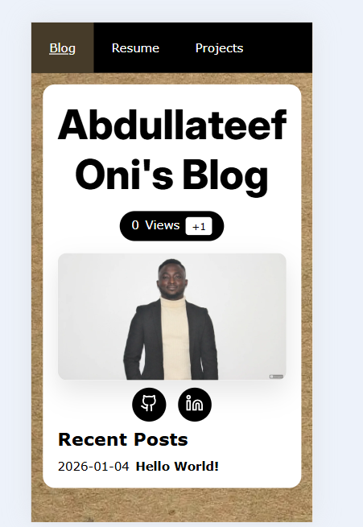

# Cloud Resume Challenge – Personal Issues & Learnings Journal

**Date Started:** Dec, 2025  
**Current Progress:** Frontend complete with blog integration; backend/cloud deployment pending  
**Goal:** Document real challenges to reinforce learning, reuse for blog/portfolio, and prepare for interviews

### 1. Transitioning from Static HTML to Component-Based Structure

**Context**  
I started with plain static HTML files for quick prototyping and layout validation. As the site expanded (adding a home page, blog list, and individual post pages), repeated elements like header, footer, and navigation became messy to maintain.  

I also couldn't copy Andrew Brown's code directly because the acceptable CV format for my region is quite different from his, so the template needed to be adjusted. Through the use of AI, I was able to generate the architectural framework for the code — see the generated resume page: [Open file](./frontend/docs/nov-11-2025-resume.html). See the AI prompt: [https://grok.com/share/c2hhcmQtMw_4e4e757b-3b85-4fff-b68a-30c89d4de1f1](https://grok.com/share/c2hhcmQtMw_4e4e757b-3b85-4fff-b68a-30c89d4de1f1)

I applied default styling on the HTML page, but noticed the CSS was not styling properly — particularly the white background for my resume was not centering within the wooden background I had chosen for the website. See the AI prompt: [https://grok.com/share/c2hhcmQtMw_e5094d01-fe5f-40e7-ab82-343234a1f8ad](https://grok.com/share/c2hhcmQtMw_e5094d01-fe5f-40e7-ab82-343234a1f8ad)

While designing CSS, I also used PostCSS to fix viewport issues so the website would look attractive on any device (mobile, laptop, or desktop). I used small, medium, and large breakpoints in my case. See AI prompt: [https://grok.com/share/c2hhcmQtMw_386c8a93-4434-4039-9508-340780a1f73e](https://grok.com/share/c2hhcmQtMw_386c8a93-4434-4039-9508-340780a1f73e)

I then converted my HTML file into JSON components, with each component representing a section of the resume: [https://chatgpt.com/share/696053ea-4988-8012-b9e2-dec0960eef97](https://chatgpt.com/share/696053ea-4988-8012-b9e2-dec0960eef97)

**Problem**  
After extracting my resume page into reusable components and reorganizing files into folders, the site broke in the browser: styles disappeared, scripts failed to load, and the terminal threw an error: [https://chatgpt.com/share/696055a0-a6a8-8012-bb55-3019d26c51b1](https://chatgpt.com/share/696055a0-a6a8-8012-bb55-3019d26c51b1).

**Root Cause**  
- Asset references (CSS/JS/images) used relative paths (`../css/style.css`) that no longer resolved correctly after restructuring.  
- JavaScript ran before dependent DOM elements existed due to changed load order.  
- Browser caching hid some issues initially.

**Resolution**  
- Standardized folder structure: `/assets` for global files, `/components` for reusables, `/pages` for routes.  
- Updated all links to use root-relative paths (e.g., `/css/style.css`) or dynamic base paths.  
- Moved script tags to the end of `<body>` and added `defer` attributes.  
- Cleared cache and used DevTools to verify network loads.

**Key Takeaways**  
- Refactoring impacts more than just code readability — it breaks paths and execution timing.  
- Plan folder structure upfront; small sites grow fast.  
- Browser DevTools (Network + Sources tabs) are lifesavers for path issues.

### 2. Adding Layout and Routes to the Entire Site

**Context**  
I added a shared Layout component using React Router v7 so that tabs like Home, Resume, Projects could render dynamically on all pages. Using ChatGPT, I came up with a layout structure — see prompt: [https://chatgpt.com/share/696055a0-a6a8-8012-bb55-3019d26c51b1](https://chatgpt.com/share/696055a0-a6a8-8012-bb55-3019d26c51b1)

**Problem**  
I got this error when rendering in the browser:

**Problem**  
I got this error when rendering in the browser:

Vite/Oxc error: `Expected > but found <` in `main.jsx:13:8` — the nested `<Route>` was missing proper closing syntax:

```jsx
<Route element={<Layout />}
  <Route path="/" element={<ResumePage />} />    <!-- problem here -->
</Route>

**Root Cause**  
My opening `<Route>` tag had an extra closing `</Route>` in the wrong place, causing a syntax error.

**Resolution**  
Removed the misplaced closing tag on the parent Route — once fixed, the layout rendered correctly.

**Key Takeaways**  
- JSX syntax errors (especially with nested Routes) can be tricky but are usually quick fixes once spotted.  
- Always double-check tag pairing in React Router setups.

### 3. Markdown-to-HTML Rendering with Python

**Context**  
I stored blog posts as Markdown files for easy writing, then used a Python script to convert them to HTML snippets for dynamic injection into the site.

**Problem**  
Fenced code blocks (e.g., ```python

**Root Cause**  
- Default Markdown parser didn't enable extensions for fenced code or other advanced features.  
- No explicit configuration for code-friendly output.

**Resolution**  
- Imported and enabled `fenced_code` and other extensions in the Python script (using `markdown` library).  
- Tested conversion on sample files and inspected raw HTML output before integrating.

**Key Takeaways**  
- Markdown isn't "plug-and-play" — extensions control output quality.  
- Always validate generated HTML separately from the final site render.

### 4. Syntax Highlighting Failures (Pygments)

**Context**  
Blog posts include code snippets in Terraform, JSON, Python, and shell — I wanted proper syntax highlighting for readability.

**Problem**  
Code blocks rendered with correct structure but no colors — just monochrome text.

**Root Cause**  
- Pygments wasn't properly integrated into the Markdown-to-HTML pipeline.  
- Missing CSS for the chosen highlight theme on the frontend.  
- I noticed my Markdown text didn't include proper backticks in some places, which contributed to display issues.

**Resolution**  
- Configured Pygments in the Python script to generate highlighted HTML.  
- Generated and included the theme CSS (e.g., "monokai") in the site's global stylesheet.  
- Fixed missing backticks in Markdown source.

**Key Takeaways**  
- Highlighting requires both backend generation **and** frontend styling.  
- Choose themes early that work in light/dark modes — and double-check your Markdown syntax!

### 5. Code Block Styling & Font Consistency

**Context**  
The site targets technical reviewers (recruiters/engineers) who expect clean, readable code examples.

**Problem**  
Code blocks used the same serif/body font as regular text, making them hard to distinguish and straining readability.

**Root Cause**  
- Global CSS resets or inheritance overrode default `<code>` and `<pre>` styling.

**Resolution**  
- Added specific rules: `pre, code { font-family: 'Courier New', monospace; }` with fallbacks.  
- Increased padding, background contrast, and line-height for better separation.

**Key Takeaways**  
- Small UI tweaks signal professionalism in technical portfolios.  
- Monospace fonts are non-negotiable for code readability.

### 6. Copying and Identifying Code Snippets

**Context**  
Reviewers need to quickly spot, read, and copy code from blog posts.

**Problem**  
Code blended into paragraph text — no visual cues, poor padding, hard to select/copy without grabbing surrounding content.

**Root Cause**  
- Minimal default styling: insufficient background, borders, or margins.

**Resolution**  
- Enhanced CSS: added subtle background (#f4f4f4), border-radius, shadow, and generous padding.  
- Considered (but skipped for now) a "copy" button for UX polish.

**Key Takeaways**  
- Usability matters — make it easy for others to engage with your technical content.  
- Accessibility (contrast, spacing) improves perceived quality.

### 7. Blog Page Not Rendering in Frontend

**Context**  
After running `npm run dev`, I noticed the blog page wasn't displaying my posts.

**Problem**  
Blogs were not rendering at all in the frontend.

**Root Cause**  
I forgot to invoke/call the `render-blog` function/logic that processes and injects the blog content.

**Resolution**  
Once I properly invoked `render-blog`, everything rendered correctly.

**Key Takeaways**  
- Small omissions (like forgetting to call a key function) can silently break entire features.  
- Always trace the data flow from source → render.

### 8. Documentation as a Learning Tool

**Context**  
Early fixes were quick-and-dirty without notes.

**Problem**  
Forgot why certain decisions were made when revisiting code weeks later.

**Resolution**  
- Started this systematic journal.  
- Added inline comments for tricky parts.

**Key Takeaways**  
- Writing forces clarity and compounds knowledge.  
- Journals turn projects into long-term assets.


### 9. My H1.fancy didn't fit on smaller pages

my h1 were out of place on smaller screen, i introduced media for smaller screens to correct this issue through the help of AI: https://grok.com/share/c2hhcmQtMw_eff35b7d-a7d0-4e1a-b8ec-b78d054b4d3d
see the previous image:


### Final Reflection

This frontend phase exposed gaps I didn't expect: lack of understanding of component architecture, content pipelines, and debugging discipline. Tutorials skip these "real" problems, but solving them built real confidence. The site now feels professional — clean, readable, and maintainable.

**Next Steps (Future Entries):**  
- Backend visitor counter (Lambda/API/DynamoDB)  
- IaC with Terraform  
- CI/CD pipelines  
- Custom domain + HTTPS  
- Full deployment and optimizations

---