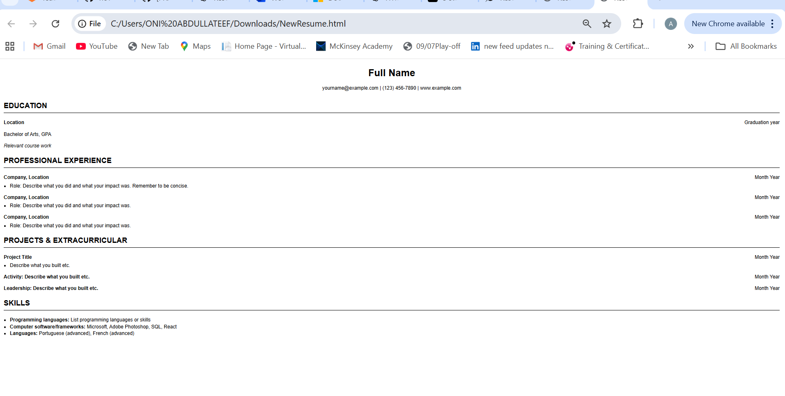

# Frontend Technical Specification

- Create a static website that serves an html resume

## Resume Format Considerations

I am aligning my resume to interntional standards across Europe and US
i am using an sample ats friendly resume template which i  got from [Microsoft Word]( https://word.cloud.microsoft/create/en/ats-templates/?source=create_flow)

### Resume Template Format Genration
Im going to let GenAI geerate out HTML and CSS from the resume template and i will manually refator the code to preferred standard

Prompt to Grok:

```text
Convert this resume format into html
please dont use a css framework.
Please use the least amount of css tags
```
Image provided to LLM


This is the [generated output](./docs/nov-11-2025-resume.html) which i will refactor

This is what the generated HTML looks like unaltered:

## HTML Adjustments
- UTF8 supports English language. I plan to use only English so i will leave this meta tag in.
- I will be applying mobile styling to my website, which includes the viewport meta tag width=device-width so mobile styles scales normally.
- I will extract the styles into its own stylesheet rather than using inline styles
- I will simplify our HTML markup css selector to be as minimal as possible
- For the HTML pages, i used soft tabs two spaces as standard and sticked to it through out the page

## server Static Website Locally
We need to serve our static website locally so we can start using the stylesheets externally from our HTML page in a Cloud Developer Environment(CDE)

>This isnt neccessary with local development 

Assuming we have node install we will use the simple web server http-server


### Install HTTP Server
```sh
npm i http-server -g

```
https://www.npmjs.com/package/http-server

### Server Website

http-server will serve a public folder by default where the command is run

```sh
cd frontend
http-server

```

## Image Size Considerations
i have a background texture that was 4.3MB
I'm going to optimise it to webp with an online tool


## Frontend Framework Consideration
- Choose to use REact because it is the most popular Javascript framwork
- Choose to use Vite.js over webpack because our frontend is very simple
- Configured React Router V&, decided to use declarative mopde because again our app is very simple